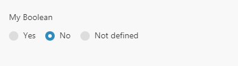
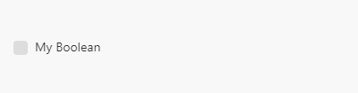

**For Modules and Connections**:  
Parameters describe what your module will receive as the input from the
user. They describe the fields that the user has to fill on the module
form in order to configure the module.

**For Remote Procedures (RPCs)**:  
Parameters describe what your remote procedure expects to receive in
order to function correctly. The parameters that you specify will be
seen while testing this remote procedure, but when you will be actually
using them, you will have to pass the parameters explicitly.

**Important**: All module parameters are passed to the RPC
automatically. E.g. you have a `firstName` parameter in your module
configuration, it will be available in your RPC as
`parameters.firstName`, just like other parameters passed to the RPC via
the query string.

| Key          | Type    | Description                                                                                                               |
| ---          | ---     | ---                                                                                                                       |
| **name**     | String  | **Required.** Internal parameter name. This is they key in the resulting object.                                          |
| **type**     | Enum    | **Required.** See list of types below.                                                                                    |
| **label**    | String  | Parameter label for the user.                                                                                             |
| **help**     | String  | Parameter description for the user.                                                                                       |
| **default**  | Any     | Specifies the default value of the parameter.                                                                             |
| **advanced** | Boolean | Specifies if the parameter is advanced or not. Advanced parameters are hidden behind a checkbox in GUI. Default: `false`. |
| **required** | Boolean | Specifies if the parameter is required. Default: `false`.                                                                 |



**Example**:
```json
[
    {
        "name": "param",
        "type": "text",
        "label": "My Parameter",
        "help": "Some help for the parameter.",
        "default": "default-value",
        "advanced": false,
        "required": true
    }
]
```

**PRO TIP 1:** You can mix parameters with RPC URLs to load parts of a
fieldset dynamically.

**PRO TIP 2:** Nested parameters are available for `boolean` and `select` field types.

## Types

- `array` - Array of items of equal type
- `boolean` - `true` or `false`
- `buffer` - Binary data
- `collection` - Key-value collection
- `color` - Hex color
- `date` - Date with time
- `email` - Email address
- `file` - File selection
- `filename` - file name
- `folder` - Folder selection
- `hidden` - Parameter of this type is hidden from the user. The value
  should always be of type `text`. If the `default` is not `text` then
  it will be converted to `text`.
- `integer` - Whole number
- `number` - Decimal number
- `path` - A path to a file or a folder
- `port` - A number in range from 0 to 65535
- `select` - A selection from predefined values
- `text` - Text value
- `time` - Time in `hh:mm` or `hh:mm:ss:` or `hh:mm:ss.nnn` format
- `timestamp` - Unix timestamp
- `timezone` - Time zone name (e.g. `Europe/Prague`)
- `uinteger` - Positive whole number
- `url` - URL address

## Boolean

| Key          | Type    | Description                                                                                                                                                                                           |
| ---          | ---     | ---                                                                                                                                                                                                   |
| **editable** | boolean | If `true`, the user can manually edit the value of this parameter (or use mappings). Default: `false`.                                                                                                |
| **nested**   | string  | Specifies a [Fields RPC](../rpc.md#fields-rpc) URL, that will be called to retrieve nested parameters (fields), that will be shown to the user if this field's checkbox will be checked. |
| **nested**   | array   | Specifies an array of nested parameters (fields), that will be shown to the user if this field's checkbox will be checked.                                                                            |

**Example**:
```json
{
    "name": "myBoolean",
    "type": "boolean",
    "label": "My Boolean",
    "nested": [
        {
            "name": "nestedField1",
            "type": "text",
            "label": "Nested Field 1"
        },
        {
            "name": "nestedField2",
            "type": "text",
            "label": "Nested Field 2"
        }
    ]
}
```

**TIP:** Boolean parameter will be show as three radiobuttons:



If you prefer a simple checkbox, add `"required" : true` to the parameter description:
```json
{
    "name": "myBoolean",
    "type": "boolean",
    "label": "My Boolean",
    "required": true,
    ]
}
```



## Array

| Key                     | Type         | Description                                                                                            |
| ---                     | ---          | ---                                                                                                    |
| **`spec`**              | array/object | Description of items in the array.                                                                     |
| **`editable`**          | boolean      | If `true`, the user can manually edit the value of this parameter (or use mappings). Default: `false`. |
| **`validate`**          | object       | Specifies parameter validation.                                                                        |
| **`validate.maxItems`** | number       | Specifies maximum length that an array parameter can have.                                             |
| **`validate.minItems`** | number       | Specifies minimum length that an array parameter can have.                                             |

**Example of array of numbers:**

```json
{
    "name": "myArray",
    "type": "array",
    "label": "My Array",
    "spec": {
        "label": "Numeric value",
        "type": "number"
    }
}
```

**Example of array of complex objects:**

```json
{
    "name": "myArray",
    "type": "array",
    "label": "My Array",
    "spec": [
        {
            "name": "email",
            "type": "email"
        },
        {
            "name": "phone",
            "type": "text"
        }
    ]
}
```

## Collection

| Key      | Type  | Description                                                      |
| ---      | ---   | ---                                                              |
| **spec** | array | Description of the collection. Should be an array of parameters. |

**Example**

```json
{
    "name": "myCollection",
    "type": "collection",
    "label": "My Collection",
    "spec": [
        {
            "name": "email",
            "type": "email"
        },
        {
            "name": "phone",
            "type": "text"
        }
    ]
}
```

## Date

| Key      | Type    | Description                                                            |
| ---      | ---     | ---                                                                    |
| **time** | boolean | If `false`, the GUI will only display date selection. Default: `true`. |

## Filename

| Key           | Type         | Description              |
| ---           | ---          | ---                      |
| **extension** | string/array | Allowed file extensions. |

**Example**

```json
{
    "name": "myFileName",
    "label": "My File Name",
    "extension": ["png", "jpg", "jpeg"]
}
```

## Number

| Key              | Type   | Description                      |
| ---              | ---    | ---                              |
| **validate**     | object | Specifies parameter validation.  |
| **validate.max** | number | Specifies maximum numeric value. |
| **validate.min** | number | Specifies minimum numeric value. |

## Select

| Key          | Type    | Description                                                                                                                       |
| ---          | ---     | ---                                                                                                                               |
| **multiple** | boolean | If `true`, multiple selection is allowed. Default: `false`.                                                                       |
| **editable** | boolean | If `true`, the user can manually edit the value of this parameter (or use mappings). Default: `false`.                            |
| **options**  | string  | Specifies an [Options RPC](../rpc.md#options-rpc) URL, that will be called to retrieve dynamic options for this RPC. |
| **options**  | array   | An array of options for this Select. See example for structure definition.                                                        | 
| **options**  | object  | Allows to specify options and nested parameters for this Select field. See below for details.                                     |

if **options** is object, then it specifies options for this select field as well as nested parameters to show when a value has
been selected.

| **options.store**  | string | Specifies an [Options RPC](../rpc.md#options-rpc) URL, that will be called to retrieve dynamic options for this RPC.                                                                      |
| **options.store**  | array  | Specifies options for this Select field.                                                                                                                                                               |
| **options.label**  | string | Specifies the name of a property that will be used as the label of an option.                                                                                                                          | 
| **options.value**  | string | Specifies the name of a property that will be used as the value of an option.                                                                                                                          |
| **options.nested** | array  | Specifies an array of nested parameters (fields), that will be shown to the user if this field's checkbox will be checked.                                                                             |
| **options.nested** | string | Specifies an [Fields RPC](../rpc.md#fields-rpc) URL, that will be called to retrieve nested parameters (fields), that will be shown to the user if this field's checkbox will be checked. |

**Example**

```json
{
    "name": "field",
    "type": "select",
    "options": [
        {
            "label": "Option A",
            "value": "a"
        },
        {
            "label": "Option B",
            "value": "b"
        }
    ]
}
```


```json
{
    "name": "field",
    "type": "select",
    "options": {
        "store": [
            {
                 "label": "Option A",
                 "value": "a"
            },
            {
                 "label": "Option B",
                 "value": "b"
            }
        ],
        "nested": [
            {
                "name": "nestedField1",
                "type": "text"
            },
            {
                "name": "nestedField2",
                "label": "Nested Field",
                "type": "text"
            }
        ] 
    }
}
```

## Text

| Key                  | Type    | Description                                                                |
| ---                  | ---     | ---                                                                        |
| **multiline**        | boolean | If `true`, user will be able to insert new lines in GUI. Default: `false`. |
| **validate**         | object  | Specifies parameter validation.                                            |
| **validate.max**     | number  | Specifies maximum length.                                                  |
| **validate.min**     | number  | Specifies minumum length.                                                  |
| **validate.enum**    | array   | Specifies an array of items that this parameter can contain.               |
| **validate.pattern** | string  | Specifies a RegExp pattern that a text parameter should conform to.        |


