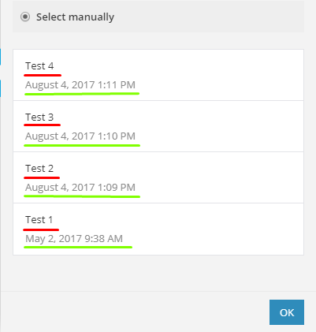

The RPC Module is a module that is used to fetch additional data for
other modules. The user cannot select it or invoke it from other
modules.

Use this module when you need to fetch additional data for other
modules.

**Note**: RPCs have special output specifications, so look at
[RPC Types](#rpc-types) to output correct data from your RPCs.

# Index

- [Communication](#communication)
  - [Specification](#specification)
  - [Making requests](#making-requests)
    - [`url`](#url)
    - [`encodeUrl`](#encode-url)
    - [`method`](#method)
    - [`headers`](#headers)
    - [`qs`](#qs)
    - [`body`](#body)
    - [`type`](#request-type)
    - [`temp`](#request-temp)
    - [`condition`](#condition)
      - [`condition`](#condition-condition)
      - [`default`](#condition-default)
    - [`aws`](#aws)
    - [`followRedirects`](#follow-redirects)
    - [`followAllRedirects`](#follow-all-redirects)
  - [Multiple requests](#multiple-requests)
  - [Handling responses](#handling-responses)
    - [`type`](#response-type)
    - [`valid`](#valid)
    - [`limit`](#limit)
    - [`error`](#error)
      - [`message`](#error-message)
      - [`type`](#error-type)
      - [`\<status-code>`](#error-status-code)
    - [`iterate`](#iterate)
      - [`container`](#iterate-container)
      - [`condition`](#iterate-condition)
    - [`temp`](#response-temp)
    - [`output`](#output)
  - [Pagination](#pagination)
    - [`mergeWithParent`](#pagination-merge-with-parent)
    - [`url`](#pagination-url)
    - [`method`](#pagination-method)
    - [`headers`](#pagination-headers)
    - [`qs`](#pagination-qs)
    - [`body`](#pagination-body)
  - [Request-less/Static mode](#static-mode)
  - [RPC Types](#rpc-types)
    - [Options RPC](#options-rpc)
    - [Fields RPC](#fields-rpc)
    - [Samples RPC](#samples-rpc)
    - [Epoch RPC](#epoch-rpc)
    - [Attach Hook RPC](#attach-rpc)
    - [Detach Hook  RPC](#detach-rpc)
  - [IML variables](#iml-variables)
  - [Error handling](#error-handling)
- [Parameters](#parameters)

# Communication

## Specification

```text
{
    "url": String,
    "encodeUrl": Boolean,
    "method": Enum[GET, POST, PUT, DELETE, OPTIONS],
    "qs": Flat Object,
    "headers": Flat Object,
    "body": Object|String|Array,
    "type": Enum[json, urlencoded, multipart/form-data, binary, text, string, raw],
    "ca": String,
    "condition": String|Boolean,
    "temp": Object,
    "oauth": Object,
    "aws": {
        "key": String,
        "secret": String,
        "session": String,
        "bucket": String,
        "sign_version": 2|4        
    },
    "response": {
        "type": Enum[json, urlencoded, xml, text, string, raw, binary, automatic]
        or
        "type": {
            "*": Enum[json, urlencoded, xml, text, string, raw, binary, automatic],
            "[Number[-Number]]": Enum[json, urlencoded, xml, text, string, raw, binary, automatic]
        },
        "temp": Object,
        "iterate": String,
        or
        "iterate": {
            "container": String|Array,
            "condition": String|Boolean
        },
        "output": String|Object|Array,
        "wrapper": String|Object|Array,
        "valid": String|Boolean,
        "error": String,
        or
        "error": {
            "message": String,
            "type": Enum[RuntimeError, DataError, RateLimitError, OutOfSpaceError, ConnectionError, InvalidConfigurationError, InvalidAccessTokenError, IncompleteDataError, DuplicateDataError],
            "[Number]": {
                "message": String,
                "type": Enum[RuntimeError, DataError, RateLimitError, OutOfSpaceError, ConnectionError, InvalidConfigurationError, InvalidAccessTokenError, IncompleteDataError, DuplicateDataError]
            }
        }
    },
    "pagination": {
        "mergeWithParent": Boolean,
        "url": String,
        "method": Enum[GET, POST, PUT, DELETE, OPTIONS],
        "headers": Flat Object,
        "qs": Flat Object,
        "body": Object|String|Array
    }
}
```

## Making requests

In order to make a request you have to specify at least a `url`.
All other directives are not required.

All Available request-related directives are shown in the table below:

| Key                                               | Type                                                                               | Description                                                                      |
| :------------------------------------             | :-----------------------------------------------------------------                 | :------------------------------------------------------------------------------- |
| [**`url`**](#url)                                 | [IML String](articles/types.md#iml-string)                                         | Specifies the URL that should be called.                                         |
| [**`encodeUrl`**](#encode-url)                    | [Boolean](articles/types.md#boolean)                                               | **Default:** true. Specifies if the URL should be auto encoded or not.           |
| [**`method`**](#method)                           | [IML String](articles/types.md#iml-string)                                         | Specifies the HTTP method, that should be used when issuing a request.           |
| [**`headers`**](#headers)                         | [IML Flat Object](articles/types.md#iml-flat-object)                               | A single level (flat) collection, that specifies request headers.                |
| [**`qs`**](#qs)                                   | [IML Flat Object](articles/types.md#iml-flat-object)                               | A single level (flat) collection that specifies request query string parameters. |
| **`ca`**                                          | [IML String](articles/types.md#iml-string)                                         | Custom Certificate Authority                                                     |
| [**`body`**](#body)                               | Any [IML Type](articles/types.md#iml-types)                                        | Specifies a request body.                                                        |
| [**`type`**](#request-type)                       | [String](articles/types.md#string)                                                 | Specifies how data are serialized into body.                                     |
| [**`temp`**](#request-temp)                       | [IML Object](articles/types.md#iml-object)                                         | Creates/updates the `temp` variable                                              |
| [**`condition`**](#condition)                     | [IML String](articles/types.md#iml-string) or [Boolean](articles/types.md#boolean) | Determines if to execute current request or never.                               |
| [**`aws`**](#aws)                                 | AWS Parameters Specification                                                       | Collection of parameters for AWS signing                                         |
| [**`followRedirects`**](#follow-redirects)        | [Boolean](articles/types.md#boolean)                                               | **Default:** true. Follow HTTP 3xx responses as redirects                        |
| [**`followAllRedirects`**](#follow-all-redirects) | [Boolean](articles/types.md#boolean)                                               | **Default:** true. Follow non-GET HTTP 3xx responses as redirects                |
| [**`response`**](#handling-responses)             | Response Specification                                                             | Collection of directives controlling processing of the response.                 |
| [**`pagination`**](#pagination)                   | Pagination Specification                                                           | Collection of directives controlling pagination logic.                           |

### `url`



### `encodeUrl` {#encode-url}



### `method`



### `headers`



### `qs`



### `body`



### `type` {#request-type}



### `temp` {#request-temp}



### `condition`



### `aws`



### `followRedirects` {#follow-redirects}



### `followAllRedirects` {#follow-all-redirects}



## Multiple Requests



## Handling responses

By default the module will output whatever it got from the remote
server.

Below is the collection of directives controlling processing of the
response. All of them must be placed inside the `response` collection.

| Key                          | Type                                                                             | Description                                                                     |
| :--------------------------- | :---------------------------------------------------------------                 | :------------------------------------------------------------------------------ |
| [**`type`**](#response-type) | [String](articles/types.md#string) or Type Specification                         | Specifies how data are parsed from body.                                        |
| [**`valid`**](#valid)        | [IML String](articles/types.md#iml-string)                                       | An expression that parses whether the response is valid or not.                 |
| [**`limit`**](#limit)        | [IML String](articles/types.md#iml-string) or [Number](articles/types.md#number) | Controls the maximum number of returned items by the module.                    |
| [**`error`**](#error)        | [IML String](articles/types.md#iml-string) or Error Specification                | Specifies how the error is shown to the user, if it would occur.                |
| [**`iterate`**](#iterate)    | [IML String](articles/types.md#iml-string) or Iterate Specification              | Specifies how response items (in case of multiple) are retrieved and processed. |
| [**`temp`**](#response-temp) | [IML Object](articles/types.md#iml-object)                                       | Creates/updates variable `temp` which you can access in subsequent requests.    |
| [**`output`**](#output)      | Any [IML Type](articles/types.md#iml-types)                                      | Describes structure of the output bundle.                                       |

### `type` {#response-type}



### `valid`



### `limit`



### `error`



### `iterate`



### `temp` {#response-temp}



### `output`



**Note**: Remote Procedures must return items in a strictly specified
schema. Look at [RPC Types](#rpc-types) for different types of schemas.

## Pagination (`pagination` directive) {#pagination}



## Request-less/Static mode {#static-mode}



## RPC Types

There are 4 types of remote procedures available in Integromat:
- [**Options RPC**](#options-rpc) - This RPC is used to retrieve items
  for a dynamic select box
- [**Fields RPC**](#fields-rpc) - This RPC is used to retrieve fields
  for a dynamic form
- [**Samples RPC**](#samples-rpc) - This RPC is used to retrieve dynamic
  sample data
- [**Epoch RPC**](#epoch-rpc) - This RPC is used to retrieve items for
  the Epoch Panel. You specify it by overriding specific trigger
  properties.
- [**Attach Hook RPC**](#attach-rpc) - This RPC is used to dynamically
  create a webhook and attach it to Integromat.
- [**Detach Hook RPC**](#detach-rpc) - This RPC is used to dynamically
  delete a webhook and detach it from Integromat.

### Options RPC

In order to correctly return options from your remote procedure, the
`output` section of `response` must contain `label` and `value` items.


```json
{
    "response": {
        "iterate": "{{body}}",
        "output": {
            "label": "{{item.username}}",
            "value": "{{item.id}}",
			"default": true
        }
    }
}
```


`label` is what the user sees when selecting items from the select box,
and `value` is what this field will get after the user selects an item.
`default` is optional and when true, option is pre-selected.

**Example usage of a select box with dynamic options:**

```json
[
    {
        "name": "param",
        "type": "select",
        "options": "rpc://NameOfMyRemoteProcedure"
    }
]
```

### Fields RPC

Loading fields from a remote server is as easy as adding a couple of
properties to `output`, namely `name` and `type`, which are required.
You can also specify any property that is used to specify module
[Parameters](#parameters), because conceptually they are the
same. The only difference is that
[Parameters](#parameters) are static, and 'Field' RPC is
dynamic.

**Note**: you should properly convert field types between your service
types and Integromat types. For that you could use
[Custom IML Functions](articles/functions.md)


```json
{
    "response": {
        "iterate": "{{body}}",
        "output": {
            "name": "{{item.key}}",
            "label": "{{item.label}}",
            "type": "text",
            "required": "{{item.isRequired == 1}}"
        }
    }
}
```


**Example usage of dynamic parameters:**

```json
"rpc://NameOfMyRemoteProcedure"
```

**Example usage of select box with nested dynamic parameters:**

```json
[
    {
        "name": "param",
        "type": "select",
        "options": [
            {
                "label": "Option 1",
                "value": 1,
                "nested": "rpc://NameOfMyRemoteProcedure"
            }
        ]
    }
]
```

### Samples RPC

Sample is an object representing one item. If you iterate, don't forget
to set limit to 1 so only one item is processed for sample data.

```json
{
    "response": {
        "limit": 1,
        "iterate": "{{body}}",
        "output": "{{item}}"
    }
}
```

**Example usage of dynamic samples:**

```json
"rpc://NameOfMyRemoteProcedure"
```

### Epoch RPC



*red - `label` and green - `date`*

To correctly return
[Epoch Panel](#epoch-panel) items from your remote procedure,
the `output` section of `response` should contain only 2 items: `label`
and `date`. The limit is used to limit the number of items displayed to
the user when using the Epoch panel.

```json
{
    "response": {
        "limit": 500,
        "iterate": "{{body}}",
        "output": {
            "label": "{{item.name}}",
            "date": "{{item.date_created}}"
        }
    }
}
```

### Attach Hook RPC {#attach-rpc}

### Detach Hook RPC {#detach-rpc}

`label` is what the user sees when selecting items from the select box
(highlighted in *red* on the screenshot above), and `date` is when
this item was created (updated), which the user will see in gray
(highlighted in *green* on the screenshot above).

## IML variables



## Error handling



# Parameters

