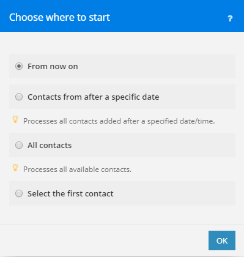

The Trigger Module is a special module that saves the information about
what was the last item processed and continues the execution from that
item, if there are some. It can also be configured to:
- Process all available and wait for new ones, without repeated processing of old item
- Process items starting from a specific date and time
- Process items starting with a specific item

Use this module when you need to process items sequentially in order
they were created/updated.

# Index

- [Communication](#communication)
  - [Specification](#specification)
  - [Making requests](#making-requests)
    - [`url`](#url)
    - [`method`](#method)
    - [`headers`](#headers)
    - [`qs`](#qs)
    - [`body`](#body)
    - [`type`](#request-type)
    - [`temp`](#request-temp)
    - [`condition`](#condition)
  - [Multiple requests](#multiple-requests)
  - [Handling responses](#handling-responses)
    - [`trigger`](#trigger)
      - [`type`](#trigger-type)
      - [`order`](#trigger-order)
      - [`id`](#trigger-id)
      - [`date`](#trigger-date)
    - [`type`](#response-type)
    - [`valid`](#valid)
    - [`limit`](#limit)
    - [`error`](#error)
      - [`message`](#error-message)
      - [`type`](#error-type)
      - [`\<status-code>`](#error-status-code)
    - [`iterate`](#iterate)
      - [`container`](#iterate-container)
      - [`condition`](#iterate-condition)
    - [`temp`](#response-temp)
    - [`output`](#output)
  - [Pagination](#pagination)
    - [`mergeWithParent`](#pagination-merge-with-parent)
    - [`url`](#pagination-url)
    - [`method`](#pagination-method)
    - [`headers`](#pagination-headers)
    - [`qs`](#pagination-qs)
    - [`body`](#pagination-body)
  - [IML variables](action.md#iml-variables)
  - [Error handling](action.md#error-handling)
- [Epoch panel](#epoch-panel)
- [Parameters](#parameters)
- [Interface](#interface)

# Communication

## Specification

```text
{
    "url": String,
    "method": Enum[GET, POST, PUT, DELETE, OPTIONS],
    "qs": Flat Object,
    "headers": Flat Object,
    "body": Object|String|Array,
    "type": Enum[json, urlencoded, multipart/form-data, binary, text, string, raw],
    "ca": String,
    "condition": String|Boolean,
    "temp": Object,
    "oauth": { // available only when using OAuth 1 connection
        "consumer_key": String,
        "consumer_secret": String,
        "private_key": String,
        "token": String,
        "token_secret": String,
        "verifier": String,
        "signature_method": String,
        "transport_method": String,
        "body_hash": String
    },
    "response": {
        "type": Enum[json, urlencoded, xml, text, string, raw, binary, automatic]
        or
        "type": {
            "*": Enum[json, urlencoded, xml, text, string, raw, binary, automatic],
            "[Number[-Number]]": Enum[json, urlencoded, xml, text, string, raw, binary, automatic]
        },
        "temp": Object,
        "iterate": String,
        or
        "iterate": {
            "container": String|Array,
            "condition": String|Boolean
        },
        "trigger": {
            "id": Strimg,
            "date": String,
            "type": Enum[id, date],
            "order": Enum[asc, desc, unordered]
        },
        "output": String|Object|Array,
        "wrapper": String|Object|Array,
        "valid": String|Boolean,
        "error": String,
        or
        "error": {
            "message": String,
            "type": Enum[RuntimeError, DataError, RateLimitError, OutOfSpaceError, ConnectionError, InvalidConfigurationError, InvalidAccessTokenError, IncompleteDataError, DuplicateDataError],
            "[Number]": {
                "message": String,
                "type": Enum[RuntimeError, DataError, RateLimitError, OutOfSpaceError, ConnectionError, InvalidConfigurationError, InvalidAccessTokenError, IncompleteDataError, DuplicateDataError]
            }
        }
    },
    "pagination": {
        "mergeWithParent": Boolean,
        "url": String,
        "method": Enum[GET, POST, PUT, DELETE, OPTIONS],
        "headers": Flat Object,
        "qs": Flat Object,
        "body": Object|String|Array
    }
}
```


## Making requests

In order to make a request you have to specify at least a `url`.
All other directives are not required.

All available request-related directives (Request Specification object)
are shown in the table below:

| Key                                   | Type                                                                               | Description                                                                      |
| :------------------------------------ | :-----------------------------------------------------------------                 | :------------------------------------------------------------------------------- |
| [**`url`**](#url)                     | [IML String](articles/types.md#iml-string)                                         | Specifies the URL that should be called.                                         |
| [**`method`**](#method)               | [IML String](articles/types.md#iml-string)                                         | Specifies the HTTP method, that should be used when issuing a request.           |
| [**`headers`**](#headers)             | [IML Flat Object](articles/types.md#iml-flat-object)                               | A single level (flat) collection, that specifies request headers.                |
| [**`qs`**](#qs)                       | [IML Flat Object](articles/types.md#iml-flat-object)                               | A single level (flat) collection that specifies request query string parameters. |
| **`ca`**                              | [IML String](articles/types.md#iml-string)                                         | Custom Certificate Authority                                                     |
| [**`body`**](#body)                   | Any [IML Type](articles/types.md#iml-types)                                        | Specifies a request body.                                                        |
| [**`type`**](#request-type)           | [String](articles/types.md#string)                                                 | Specifies how data are serialized into body.                                     |
| [**`temp`**](#request-temp)           | [IML Object](articles/types.md#iml-object)                                         | Creates/updates the `temp` variable                                              |
| [**`condition`**](#condition)         | [IML String](articles/types.md#iml-string) or [Boolean](articles/types.md#boolean) | Determines if to execute current request or never.                               |
| [**`response`**](#handling-responses) | Response Specification                                                             | Collection of directives controlling processing of the response.                 |
| [**`pagination`**](#pagination)       | Pagination Specification                                                           | Collection of directives controlling pagination logic.                           |

### `url`



### `method`



### `headers`



### `qs`



### `body`



### `type` {#request-type}



### `temp` {#request-temp}



### `condition`



## Multiple Requests



## Handling responses

By default the module will output whatever it got from the remote
server.

Below is the collection of directives controlling processing of the
response. All of them must be placed inside the `response` collection.

| Key                          | Type                                                                             | Description                                                                     |
| :--------------------------- | :---------------------------------------------------------------                 | :------------------------------------------------------------------------------ |
| [**`trigger`**](#trigger)    | Trigger Specification                                                            | Collection of directives controlling trigger logic                              |
| [**`type`**](#response-type) | [String](articles/types.md#string) or Type Specification                         | Specifies how data are parsed from body.                                        |
| [**`valid`**](#valid)        | [IML String](articles/types.md#iml-string)                                       | An expression that parses whether the response is valid or not.                 |
| [**`limit`**](#limit)        | [IML String](articles/types.md#iml-string) or [Number](articles/types.md#number) | Controls the maximum number of returned items by the module.                    |
| [**`error`**](#error)        | [IML String](articles/types.md#iml-string) or Error Specification                | Specifies how the error is shown to the user, if it would occur.                |
| [**`iterate`**](#iterate)    | [IML String](articles/types.md#iml-string) or Iterate Specification              | Specifies how response items (in case of multiple) are retrieved and processed. |
| [**`temp`**](#response-temp) | [IML Object](articles/types.md#iml-object)                                       | Creates/updates variable `temp` which you can access in subsequent requests.    |
| [**`output`**](#output)      | Any [IML Type](articles/types.md#iml-types)                                      | Describes structure of the output bundle.                                       |

### `trigger`

The trigger collection specifies directives that will control how the
trigger will work and how your data will be processed

| Key                           | Type                                       | Description                                                   |
| :---------------------------- | :----------------------------------        | :------------------------------------------------------------ |
| [**`type`**](#trigger-type)   | `date` or `id`                             | Specifies how the trigger will behave and sort items          |
| [**`order`**](#trigger-order) | `asc` or `desc`                            | Specifies in what order the remote API returns items          |
| [**`id`**](#trigger-id)       | [IML String](articles/types.md#iml-string) | Must return current item's Id                                 |
| [**`date`**](#trigger-date)   | [IML String](articles/types.md#iml-string) | When used, must return current item's create/update timestamp |

### `trigger.type` {#trigger-type}

**Required**: yes  
**Default**: empty  
**Values**: `id` or `date`

The `trigger.type` directive specifies how the trigger will sort and
iterate through items.

If the processed item has a create/update timestamp, then `date` should
be used as a value, and a correct getter should be specified in
`trigger.date` directive. The trigger will then sort all items by their
date and id fields and return only unprocessed items.

If the processed item does not have a create/update timestamp, but only
an id, then `id` should be used as a value, and a correct getter should
be specified in `trigger.id` directive.

### `trigger.order` {#trigger-order}

**Required**: yes  
**Default**: empty  
**Values**: `asc`, `desc` or `unordered`

The `trigger.order` directive specifies in what order the remote API is
returning items - descending, ascending or unordered. This information
is needed to correctly determine if there are more pages to be fetched
or no. It is also needed to correctly sort the incoming items and
display them to the user in ascending order.

So if the API is returning items in ascending order (low to high), then
`asc` should be used. If the API is returning items in descending order
(high to low), then `desc` should be used. If the API is returning items
in no appernt order, then `unordered` should be used.

### `trigger.id` {#trigger-id}

**Required**: yes  
**Default**: empty

This directive specifies the item's id. It must always be present. For
example, if your item looks like this

```json
{
    "id": 24,
    "name": "Fred",
    "friend_count": 5
}
```

Then you should specify your `trigger.id` directive like this:
`{{item.id}}`

```json
{
    "response": {
        "trigger": {
            "id": "{{item.id}}"
        }
    }
}
```


### `trigger.date` {#trigger-date}

**Required**: yes  
**Default**: empty

This directive specifies the item's date. It must be specified when the
`trigger.type` is set to `date`. Note that `trigger.id` must always be
specified.

For example, if your item looks like this

```json
{
    "id": 24,
    "name": "Fred",
    "friend_count": 5,
    "created_date": "2017-07-05T13:05"
}
```


Then you should specify your `trigger.date` directive like this:
`{{item.created_date}}`, and your trigger collection might look
something like this

```json
{
    "response": {
        "trigger": {
            "id": "{{item.id}}",
            "date": "{{item.created_date}}"
        }
    }
}
```


### `type` {#response-type}



### `valid`



### `limit`



### `error`



### `iterate`



### `temp` {#response-temp}



### `output`



## Pagination (`pagination` directive) {#pagination}



## IML variables



## Error handling



# Epoch panel



The epoch panel is a popup window offered to the user when selecting
where to start from when configuring a trigger.

If the `Epoch configuration` is defined, then there will be at least 1
item available in the Epoch panel: `Select`, which will allow the user
to select an item the user wants to start with. Other items depend on
the trigger type. The underlying data is retrieved via the
[Epoch RPC](rpc.md#epoch-rpc).

If the trigger `type` is `id`, then there will be one more option
available: `All`, which will allow the user to process all the items
from the beginning. But, if the `Epoch configuration` was not specified,
then the Epoch panel will not be available to the user.

On the other hand, if the trigger `type` is `date`, then 3 additional
options will be available for the user: `All`, `From date` and `From
now`. `From date` will allow the user to start processing items from a
specific day forward and from now is the same as `From date`, except the
date is automatically set to current date and time.

### Retrieving data for the Epoch panel

You can customize how the data for the Epoch panel will be retrieved by
providing specific request overrides in the `Epoch` section. These
overrides will then be merged with trigger configuration to retrieve the
data.

You also have to provide the labels and dates for the returned items.
You can do that with with the `response.output` directive. Dates are not required, but it
would be better to provide them for better user experience.

Please see [Epoch RPC](rpc.md#epoch-rpc) on how to specify labels
and dates for the output.

# Parameters



# Interface

Describes structure of output bundles. Specification is the same as
[Parameters](action.md#parameters).

```json
[
    {
        "name": "id",
        "type": "uinteger",
        "label": "User ID"
    }
]
```